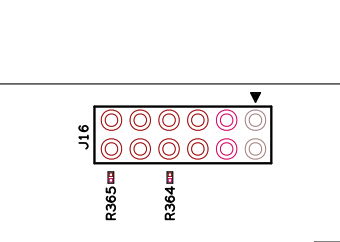
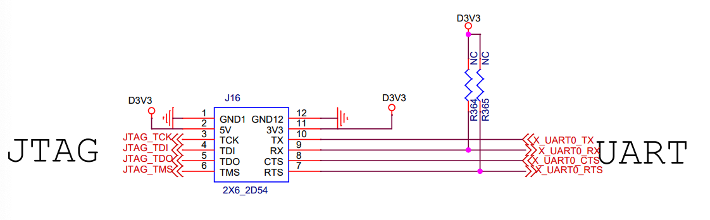

# Milk-V Vega

## 启动流程
Milk-V Vega 搭载了轩辕 FSL91030M，该芯片上电后启动流程分为如下 5 个步骤，分别是 freeloader -> opensbi -> uboot -> kernel -> rootfs。

其中 freeloader 启动流程如下：
设置异常和中断跳转地址 -> 分别搬运 opensbi，uboot，kernel，rootfs，fdt 到 ddr 对应的位置 -> 跳转到 opensbi

## 调试串口
J16 为调试串口，它的 pin 脚定义如下所示：




Milk-V Vega 默认已烧录系统，帐号和密码分别为 root 和 fsl，串口波特率 115200,8N1。

## 软件版本

Milk-V Vega 上烧录的系统，基于以下版本生成。

| 序号 | 软件名称   | 软件包版本                     |
| ---- | ---------- | ------------------------------ |
| 1    | freeloader | -                              |
| 2    | opensbi    | v0.7                           |
| 3    | u-boot     | 2020.07-rc2                    |
| 4    | kernel     | 5.8.0                          |
| 5    | rootfs     | busybox: v1.31.1, glibc: v2.29 | 


## 存储设备

Milk-V Vega 两个 spi 分别挂有 nor flash (4M) 和 nand flash (128M)。

nor flash 用于放置启动引导程序 uboot，设备树 dtb，和 uboot 环境变量 env。

nand flash 用于存放内核 kernel，根文件系统 rootfs（ubifs）。

## 烧写系统

uboot 中集成了相关烧写指令，可通过 tftp 下载文件并进行烧写。将指定名称的文件放入 tftpboot 文件夹下，即可执行下面命令进行烧写。

```
    run updateos_nand                      // 烧写 kernel.bin 到 kernel_nand 分区
    run updateubifs_boot                   // 烧写 ubifs.img  到 ubifs_nand  分区
    setenv bootcmd run bootcmd_ubifs_boot  // 设置启动命令
    saveenv                                // 保存环境变量
    boot                                   // 启动 linux
```

nand flash (128M) 在 uboot 下分区如下：

| 名称              | kernel      | rootfs                | rootfs_ubifs                  | reserved |
| ----------------- | ----------- | --------------------- | ----------------------------- | -------- |
| 分区大小（bytes） | 4M          | 20M                   | 16M / 40M           |      88M / 64M    |
| 分区首地址        | 0x0         | 0x400000              | 0x1800000                     | -        |
| 作用              | 存放内核    | 存放 ramfs 的文件系统 | 存放并运行 ubifs 的根文件系统 | 保留     |
| uboot 分区        | kernel_nand | ramfs_nand            | ubifs_nand                    | -        |
| 烧写文件          | kernel.bin  | initrd.bin            | ubifs.img                     | -        |             |
